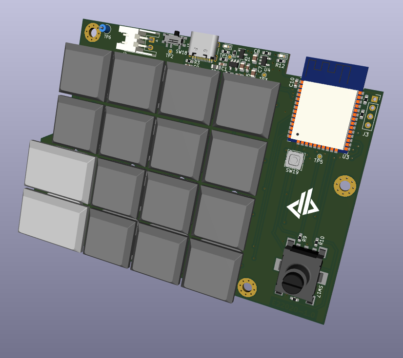
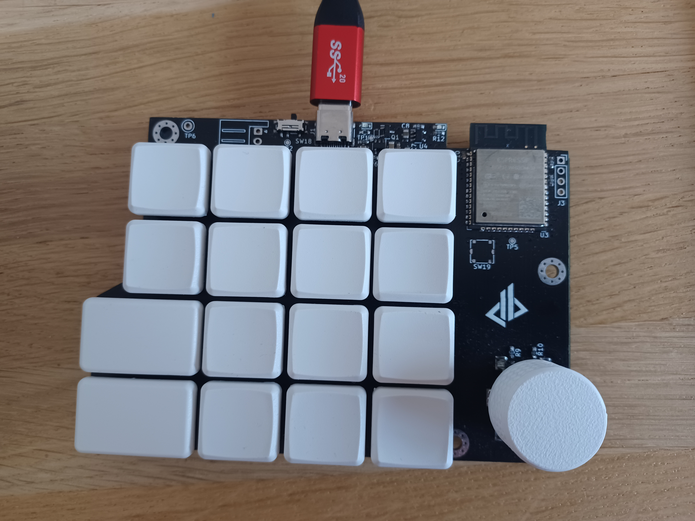

# Macropad

This is a custom macropad with 4x4 keys and a rotary knob.

I wanted it to be wireless so it is built arround an ESP32 module with Bluetooth.

It is built to be used with Kailh Choc keyswitches to have a lower profile than classical mechanical switches.

Shortly after I started to work on this project, the folks from [DeepSea-Developments](https://github.com/DeepSea-Developments) announced their own work on the [DeepDeck](https://deepdeck.co/) macropad. So I benefit from their work to design my own macropad.

I also switched from other existing firmwares I was trying to their work on the [DeepDeck firmware](https://github.com/DeepSea-Developments/DeepDeck.Ahuyama.fw)

## Warnings
My work is distributed in the home it can be useful, but **WITHOUT ANY WARRANTY**

This product is meant to be used with battery, but v1.0 has never be tested in battery power mode right now, so take care of what you do.

## Thanks
- To [DeepSea-Developments](https://www.deepseadev.com/), creators of the [DeepDeck](https://deepdeck.co/) macropad for their work.
- To [Yannick Hemery](https://github.com/yhemery), for taking time to fine tune the DeepDeck firmware to fit my hardware design.
